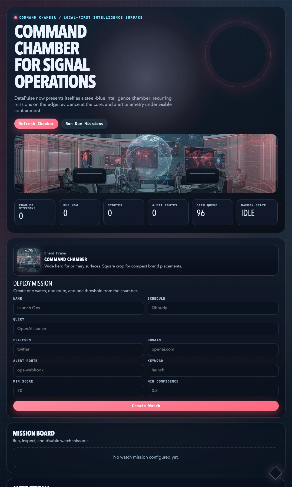

# DataPulse 浏览器控制台参数填写说明



## 适用范围

本文档说明 `datapulse-console` 当前浏览器表单 `Deploy Mission` 中每个参数的实际含义、填写建议，以及它们最终映射到的后端字段。

当前说明基于仓内已实现行为，不描述尚未开放的理想字段。

## 当前表单范围

浏览器表单当前用于创建一个 watch mission，并可选附带一条基础 alert rule。

当前支持：

- mission 基本信息：`name`、`query`、`schedule`、`platform`
- alert 基础过滤：`route`、`keyword`、`domain`、`min_score`、`min_confidence`

当前未在浏览器表单暴露，但 CLI / MCP / API 已支持：

- `sites`
- `top_n`
- 多平台输入
- 多条 `alert_rules`
- `required_tags` / `excluded_tags`
- `source_types`
- `max_age_minutes`
- 非 `json` 直配 channel

## 字段说明

| 控制台字段 | 是否必填 | 实际写入字段 | 填写建议 | 示例 |
| --- | --- | --- | --- | --- |
| `Name` | 是 | `name` | 任务名称，建议写成稳定、可辨识的 mission 名称 | `Launch Ops` |
| `Schedule` | 否 | `schedule` | 留空即 `manual`；支持 `@hourly` / `@daily` / `@weekly` / `interval:15m` / `every:30m` | `@hourly` |
| `Query` | 是 | `query` | 任务主查询词；建议写主题、公司、人物、产品名 | `OpenAI launch` |
| `Platform` | 否 | `platforms[0]` | 当前表单只支持单个平台；留空表示不限定平台 | `twitter` |
| `Alert Domain` | 否 | `alert_rules[0].domains[0]` | 这是==告警过滤域名==，不是 mission 的 `sites` 搜索范围 | `openai.com` |
| `Alert Route` | 否 | `alert_rules[0].routes[0]` | 对应命名告警路由，需先在 `DATAPULSE_ALERT_ROUTING_PATH` 配置 | `ops-webhook` |
| `Alert Keyword` | 否 | `alert_rules[0].keyword_any[0]` | 告警命中时要求结果文本至少包含该关键词之一 | `launch` |
| `Min Score` | 否 | `alert_rules[0].min_score` | 告警最低分阈值；建议从 `60~80` 起试 | `70` |
| `Min Confidence` | 否 | `alert_rules[0].min_confidence` | 告警最低置信度阈值；通常填 `0.6~0.9` | `0.8` |

## 关键行为说明

### 1. 什么情况下会创建 alert rule

当前控制台只有在以下任一字段被填写时，才会自动创建 `console-threshold` 这条 alert rule：

- `Alert Route`
- `Alert Keyword`
- `Alert Domain`
- `Min Score > 0`
- `Min Confidence > 0`

如果这些字段全部留空，则只创建 watch mission，不创建 alert rule。

### 2. `Alert Domain` 不是搜索站点范围

当前浏览器表单里的 `Alert Domain` 写入的是：

```json
{
  "alert_rules": [
    {
      "domains": ["openai.com"]
    }
  ]
}
```

它只影响告警命中条件，不会把 mission 的搜索/抓取范围限制到该域名。

如果你需要真正的站点范围限定，请暂时使用：

- CLI：`--watch-site`
- MCP / API：`sites`

### 3. `Platform` 当前只支持单值

浏览器表单当前只有一个 `Platform` 输入框，因此最终会生成单元素数组：

```json
{
  "platforms": ["twitter"]
}
```

如果你需要一个 mission 同时覆盖多个平台，请暂时使用 CLI / MCP / API。

### 4. 默认 alert channel

浏览器表单当前创建的 alert rule 默认包含：

```json
{
  "channels": ["json"]
}
```

这意味着：

- 告警事件会先写入本地 alert store
- 如果额外填写了 `Alert Route`，会再尝试走命名 route 分发

## 推荐填写模板

### 模板 A：只建 mission，不发告警

适合先观察结果、暂不触发任何告警。

- `Name`: `AI Radar`
- `Schedule`: `@hourly`
- `Query`: `OpenAI agents`
- `Platform`: `twitter`
- 其余 alert 字段全部留空

结果：

- 创建 watch mission
- 不创建 alert rule

### 模板 B：定时监控 + 基础阈值告警

- `Name`: `Launch Ops`
- `Schedule`: `@hourly`
- `Query`: `OpenAI launch`
- `Platform`: `twitter`
- `Alert Route`: `ops-webhook`
- `Alert Keyword`: `launch`
- `Alert Domain`: `openai.com`
- `Min Score`: `70`
- `Min Confidence`: `0.8`

适合高价值主题监控。

### 模板 C：人工触发的临时观察任务

- `Name`: `Infra Manual Review`
- `Schedule`: 留空
- `Query`: `LLM inference infra`
- `Platform`: 留空
- alert 字段按需填写

结果：

- mission 为 `manual`
- 只会在你手动点击 `Run Mission` 或通过其他控制面执行时运行

## 对应 API payload 示例

当你填写：

- `Name = Launch Ops`
- `Schedule = @hourly`
- `Query = OpenAI launch`
- `Platform = twitter`
- `Alert Route = ops-webhook`
- `Alert Keyword = launch`
- `Alert Domain = openai.com`
- `Min Score = 70`
- `Min Confidence = 0.8`

浏览器当前会生成等价请求：

```json
{
  "name": "Launch Ops",
  "query": "OpenAI launch",
  "schedule": "@hourly",
  "platforms": ["twitter"],
  "alert_rules": [
    {
      "name": "console-threshold",
      "min_score": 70,
      "min_confidence": 0.8,
      "channels": ["json"],
      "routes": ["ops-webhook"],
      "keyword_any": ["launch"],
      "domains": ["openai.com"]
    }
  ]
}
```

## 与其他控制面的关系

浏览器表单适合：

- 快速建一个 mission
- 快速附加一个基础告警条件
- 本地单用户试运行

CLI / MCP / API 更适合：

- 批量创建 mission
- 多平台 / 多规则配置
- 精细 alert filter
- 更复杂的自动化编排

## 相关文档

- [GUI 控制台规划](gui_intelligence_console_plan.md)
- [数据源与订阅化增强计划](source_feed_enhancement_plan.md)
- [README](../README.md)
